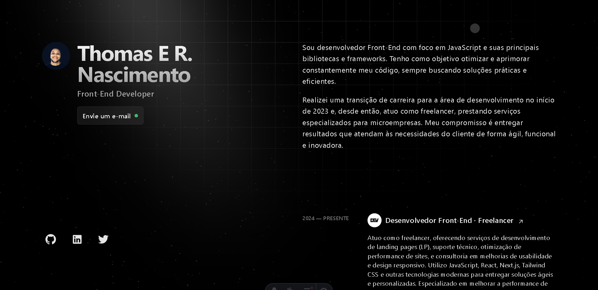

# 📝  **CV Online**

Bem-vindo ao meu **Currículo Online**! Aqui você pode conferir minhas habilidades, experiência e projetos de forma interativa. Este CV é projetado para dar uma visão clara sobre minhas competências técnicas e projetos realizados, e é totalmente acessível online.

---

<div align="center">
  
  
</div>

<p align="center">
Este código está licenciado sob a licença MIT, e as palavras e imagens são licenciadas sob a licença <a href='https://creativecommons.org/licenses/by-nc-sa/4.0/'>CC BY-NC-SA 4.0</a>.
</p>

---

## 🚀 **Estrutura do Projeto**

Dentro deste projeto, você encontrará a seguinte estrutura de diretórios e arquivos:

```text
/
├── public/
│   └── favicon.svg
├── src/
│   ├── components/
│   │   └── Card.astro
│   ├── layouts/
│   │   └── Layout.astro
│   └── pages/
│       └── index.astro
└── package.json
```
